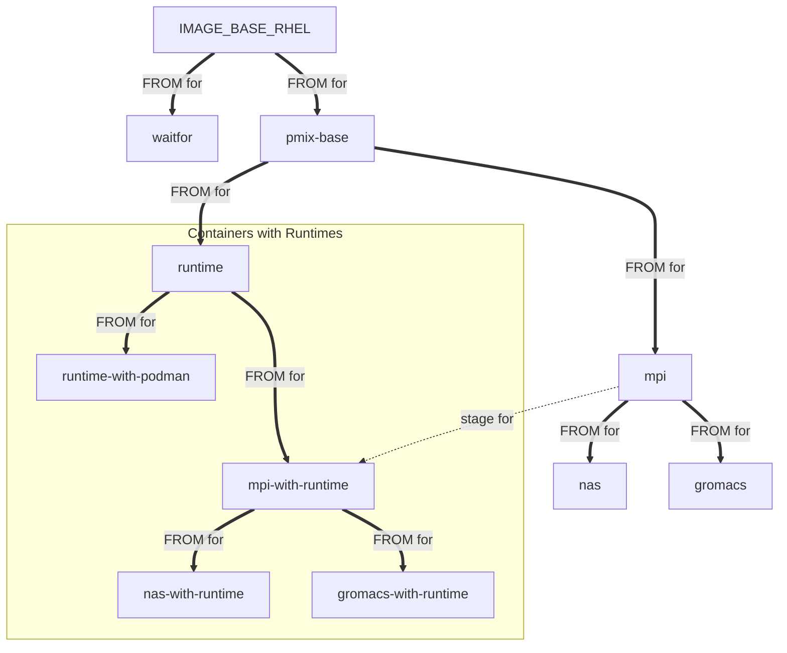

# CANOPIE-HPC 2022: A separated model for running rootless, unprivileged PMIx-enabled HPC applications in Kubernetes

The software in this repository pairs with the CANOPIE-HPC 2022 workshop paper:
 * "A separated model for running rootless, unprivileged PMIx-enabled HPC applications in Kubernetes"
 * **Note:** This paper is under review.

## Demonstration from the paper


Build the images:
```
export IMAGE_REGISTRY=PATH_TO_MY_REGISTRY/USERNAME
export IMAGE_TAG_NAME="latest"

# if you are using Docker instead of Podman
#export IMAGE_BUILD_CMD="docker build"
#export IMAGE_PUSH_CMD="docker push"

make images
make push-images
```

Set your context to the soon to be created `kube-pmix` namespace:
```
kubectl config set-context --current --namespace=kube-pmix
```

### Deploy the virtual cluster:

Deploy the cluster:
```
make deploy-ssh-with-podman-unpriv
```

Login to the cluster:
```
make login-ssh-with-podman-unpriv
```

### Run the MPI Example

Within the virtual cluster run:
```
export MPI_IMAGE='MYREPO/k8s-mpi'

podman pull -q $MPI_IMAGE
prterun --map-by ppr:1:node podman pull -q $MPI_IMAGE

prterun --map-by ppr:2:node -x MPI_IMAGE /opt/hpc/local/bin/wrap-container.sh /opt/hpc/examples/bin/init_finalize
```

### Run the NAS Example

Within the virtual cluster run:
```
export MPI_IMAGE='MYREPO/k8s-nas'

podman pull -q $MPI_IMAGE
prterun --map-by ppr:1:node podman pull -q $MPI_IMAGE

prterun --map-by ppr:2:node -x MPI_IMAGE /opt/hpc/local/bin/wrap-container.sh \
    /opt/hpc/local/nas/bin/ep.A.x
```

### Run the Gromacs Example

Within the virtual cluster run:
```
export MPI_IMAGE='MYREPO/k8s-gromacs'

podman pull -q $MPI_IMAGE
prterun --map-by ppr:1:node podman pull -q $MPI_IMAGE

prterun --map-by ppr:2:node -x MPI_IMAGE /opt/hpc/local/bin/wrap-container.sh \
    /opt/hpc/local/gromacs/bin/gmx_mpi mdrun -s \
    /opt/hpc/local/gromacs/examples/benchMEM/benchMEM.tpr -nsteps 10
```


### Shutdown the virtual cluster:

Deploy the cluster:
```
make undeploy-ssh-with-podman-unpriv
```


## Outline

 * [Build the images](#build-the-images)
 * [Virtual Clusters](#virtual-clusters)
 * [`prterun` vs `prun`](#prterun-vs-prun)
 * Traditional Techniques:
   * ["Traditional MPI with ssh"](#traditional-mpi-with-ssh)
   * ["Traditional MPI with kubectl"](#traditional-mpi-with-kubectl)
   * Both the "Traditional MPI with ssh" and "Traditional MPI with kubectl" solutions are non-optimal for a variety of reasons. See discussion [here](https://github.com/kubeflow/mpi-operator/issues/341#issuecomment-1049153081) for a taste.
 * Podman base Techniques using the `privileged` option:
   * ["Podman environment with ssh for MPI containers"](#podman-environment-with-ssh-for-mpi-containers)
   * ["Podman environment with kubectl for MPI containers"](#podman-environment-with-kubectl-for-mpi-containers)
 * Podman Techniques not using the `privileged` option:
   * ["Podman environment without privileged flag with ssh for MPI containers"](#podman-environment-without-privileged-flag-with-ssh-for-mpi-containers)
   * ["Podman environment without privileged flag with kubectl for MPI containers"](#podman-environment-without-privileged-flag-with-kubectl-for-mpi-containers)
 * [NAS Parallel Benchmarks](https://www.nas.nasa.gov/software/npb.html)
   * ["NAS MPI Application"](#nas-mpi-application)
 * [Gromacs](https://www.gromacs.org/)
   * ["Gromacs MPI Application"](#gromacs-mpi-application)
 * [FAQ](#faq)


## Kubernetes setup

 * Two helpful articles
   * [How to use Podman inside of a container](https://www.redhat.com/sysadmin/podman-inside-container)
   * [How to use Podman inside of Kubernetes](https://www.redhat.com/sysadmin/podman-inside-kubernetes)
 * To run "Rootless Podman without the privileged flag" you will need to have a means of mounting the `/dev/fuse` filesystem mount into the container.
   * We do this using a Kubernetes [`DevicePlugin`](https://kubernetes.io/docs/concepts/extend-kubernetes/compute-storage-net/device-plugins/)
   * I forked an updated an existing project that does just that in [https://github.com/jjhursey/fuse-device-plugin/tree/ppc64le-support](fuse-device-plugin GitHub Project)

```
git clone -b ppc64le-support git@github.com:jjhursey/fuse-device-plugin.git
cd fuse-device-plugin

export IMAGE_REGISTRY=quay.io/<my-user>
make all

make deploy
```

Then verify that each of the nodes in the cluster has an allocatable system resource labeled as:
```
  github.com/fuse:    5k
```

The virtual clusters that run podman without the `--privileged` flag will rely on this DaemonSet.


## Build the images

The `IMAGE_REGISTRY` envar defines the image registry that you will be using for your images.

```bash
export IMAGE_REGISTRY=quay.io/<my-user>
make images
make push-images
```

Images:
 * `IMAGE_BASE_RHEL` : envar that defines the base RHEL image (e.g., UBI 8)
   * `k8s-waitfor` : Wait-for utility container for K8s Jobs
   * `k8s-pmix-base` : OpenPMIx and dependencies (no ssh)
     * `k8s-runtime` : PMIx Runtime (PRRTE) and dependencies (ssh, kubectl)
       * `k8s-runtime-with-podman` : PMIx Runtime (above) with a rootless Podman setup
       * `k8s-mpi-with-runtime` : Open MPI `main` with a PMIx Runtime
         * `k8s-nas-with-runtime` : NAS Parallel Benchmark with a PMIx Runtime
         * `k8s-gromacs-with-runtime` : Gromacs with a PMIx Runtime
     * `k8s-mpi` : Open MPI `main` without a PMIx Runtime
       * `k8s-nas` : NAS Parallel Benchmark
       * `k8s-gromacs` : Gromacs

<!-- https://mermaid.live/edit -->
<!-- https://mermaid-js.github.io/mermaid/#/flowchart -->


## Virtual Clusters

The `kustomize` tool is used to define a "virtual cluster" environment in Kubernetes. The virtual cluster is composed of the following Kubernetes objects:
 * `Namespace` : A context to run the cluster.
 * `ServiceAccount` : RBAC authority.
 * `ClusterRole` : RBAC authority.
 * `ClusterRoleBinding` : RBAC authority connecting the `ClusterRole` and the `ServiceAccount` to the `Namespace`.
 * `Service` : Headless service to provide DNS to the virtual cluster.
 * `StatefulSet` : A set of `Pod`s representing compute nodes in the virtual cluster.
 * `Job` : A `Pod` representing a login node in the virtual cluster.

For all of these commands we assume that you are working in the `kube-pmix` namespace (which is automatically created), and have enough access to Kubernetes to create the objects listed above.
```
kubectl config set-context --current --namespace=kube-pmix
```

### `prterun` vs `prun`

In the examples we will often use `prterun` which is similar to `mpirun`/`mpiexec` in that it starts up a daemon on each compute node then launches the application. This is helpful for a one-off launch.

The PRRTE runtime also has a persistent mode that separates the launching/terminating of the daemons from the application launch. This is helpful when you intend to launch a large number of jobs in the same cluster since you do not pay the cost of starting the daemons for each job.

In the examples that use `prterun` you can replace it with `prun` if you have the `prte` daemon running.

**Start the PRRTE persistent daemon**
```bash
unset PRTE_MCA_schizo_proxy
prte --daemonize
```

**Run a job**
```bash
prun hostname
```

**Terminate the PRRTE persistent daemon**
```bash
pterm
```


### Traditional MPI with ssh

**Traditional mode:** Virtual cluster with SSH daemons to move between nodes

A virtual cluster will use the `k8s-mpi-with-runtime` image in a virtual cluster connected via SSH daemons. The MPI container includes the runtime environment and the SSH setup.

**Launch the cluster**
```shell
make deploy-ssh-with-mpi
```

**Login to the cluster** -- this will wait for the cluster to come online and then drop you into a shell in the login node (`Job`):
```shell
make login-ssh-with-mpi
```

**Run an parallel job in the cluster**

First try to run `hostname` to make sure the runtime is using all of the compute nodes (`Statefulset`):
```shell
[mpiuser@hpc-cluster-login-5bvmj ~]$ prterun --map-by ppr:2:node hostname
hpc-cn-0
hpc-cn-0
hpc-cn-4
hpc-cn-4
hpc-cn-2
hpc-cn-2
hpc-cn-1
hpc-cn-1
hpc-cn-3
hpc-cn-3
```

Next try to run a simple MPI program (`init_finalize`) to confirm that the processes are wiring up correctly for MPI:
```shell
[mpiuser@hpc-cluster-login-5bvmj ~]$ prterun --personality ompi --map-by ppr:2:node /opt/hpc/examples/bin/init_finalize
 0) Size: 10 (Running)
 0) NP  :        10 procs [   5 Nodes at   2 PPN]
 0) Init:     0.015 sec
 0) Barr:     0.020 sec
 0) Fin :     0.052 sec
 0) I+F :     0.067 sec
 0) Time:     0.087 sec
```

When you are finished just exit the shell. As long as the virtual cluster is running you can logout and login as much as you need to.

Since the SSH daemon is running on all of the compute nodes (note that it is __not__ running on the login node) you will need the domain:
```
[mpiuser@hpc-cluster-login-5bvmj ~]$ ssh hpc-cn-0.hpc-cluster.kube-pmix
[mpiuser@hpc-cn-0 ~]$ hostname
hpc-cn-0
[mpiuser@hpc-cn-0 ~]$
```

**Shutdown the cluster**
```shell
make undeploy-ssh-with-mpi
```

### Traditional MPI with kubectl

**Traditional mode:** Virtual cluster with `kubectl` to move between nodes

A virtual cluster will use the `k8s-mpi-with-runtime` image in a virtual cluster. In this mode no SSH daemons are used. Instead the `kubectl exec` command is used as an SSH proxy to move between nodes. The MPI container includes the runtime environment and the `kubectl` setup.

The instructions are the same as the "ssh-with-mpi" just change the "ssh" to "kubectl" in the `make` commands.

No SSH daemon is running on the nodes, as seen below.
```
[mpiuser@hpc-cluster-login-4c55k ~]$ ssh hpc-cn-0.hpc-cluster.kube-pmix
ssh: connect to host hpc-cn-0.hpc-cluster.kube-pmix port 22: Connection refused
```

The runtime uses a script around `kubectl exec` to serve as an SSH proxy for the runtime launching mechanism to start processes on the remote nodes (note that we are using the domain name but the "pod name"):
```
[mpiuser@hpc-cluster-login-4c55k ~]$ /opt/k8s/bin/kubexec.sh hpc-cn-0 hostname
hpc-cn-0
```


### Podman environment with ssh for MPI containers

**Container mode - Podman:** Virtual cluster with SSH daemons to move between nodes and Podman installed. MPI is a separate container.

A virtual cluster will use the `k8s-runtime-with-podman` image in a virtual cluster connected via SSH daemons. The container does not include the MPI application. It only includes the runtime environment, podman setup, and the SSH setup.

We will use the `k8s-mpi` container inside this virtual cluster to launch the MPI application

**Launch the cluster**
```shell
make deploy-ssh-with-podman
```

**Login to the cluster** -- this will wait for the cluster to come online and then drop you into a shell in the login node (`Job`):
```shell
make login-ssh-with-podman
```

**Run an parallel job in the cluster**

First try to run `hostname` to make sure the runtime is using all of the compute nodes (`Statefulset`):
```shell
[mpiuser@hpc-cluster-login-2gzzq ~]$ prterun --map-by ppr:2:node hostname
hpc-cn-3
hpc-cn-3
hpc-cn-1
hpc-cn-1
hpc-cn-4
hpc-cn-4
hpc-cn-2
hpc-cn-2
hpc-cn-0
hpc-cn-0
```

Next pull your MPI container onto the hosts. This will happen automatically, but doing this first will speed up the application launches later. The `MPI_IMAGE` envar should point to a container registry accessible from the virtual cluster.
```shell
export MPI_IMAGE='quay.io/<my-user>/k8s-mpi'

podman pull $MPI_IMAGE

prterun --map-by ppr:1:node podman pull -q $MPI_IMAGE
```

Next try to run a simple MPI program (`init_finalize`). The MPI application is inside a container so we need the runtime to launch it for us. A `/opt/hpc/local/bin/wrap-container.sh` script is used to set all of the necessary container runtime options so that the per-process container can interact freely with the other container instances on the same node (e.g., for shared memory).
```shell
[mpiuser@hpc-cluster-login-2gzzq ~]$ prterun --personality ompi --map-by ppr:2:node /opt/hpc/examples/bin/init_finalize
--------------------------------------------------------------------------
prterun was unable to launch the specified application as it lacked
permissions to execute an executable:

Executable: /opt/hpc/examples/bin/init_finalize
Node: hpc-cn-3

while attempting to start process rank 6.
--------------------------------------------------------------------------
[mpiuser@hpc-cluster-login-2gzzq ~]$ prterun --personality ompi --map-by ppr:2:node -x MPI_IMAGE /opt/hpc/local/bin/wrap-container.sh /opt/hpc/examples/bin/init_finalize
 0) Size: 10 (Running)
 0) NP  :        10 procs [   5 Nodes at   2 PPN]
 0) Init:     0.020 sec
 0) Barr:     0.011 sec
 0) Fin :     1.010 sec
 0) I+F :     1.030 sec
 0) Time:     1.041 sec
```

When you are finished just exit the shell. As long as the virtual cluster is running you can logout and login as much as you need to.


**Shutdown the cluster**
```shell
make undeploy-ssh-with-podman
```

### Podman environment with kubectl for MPI containers

**Container mode - Podman:** Virtual cluster with kubectl to move between nodes and Podman installed. MPI is a separate container.

A virtual cluster will use the `k8s-runtime-with-podman` image in a virtual cluster connected via kubectl. The container does not include the MPI application. It only includes the runtime environment, and podman setup.

We will use the `k8s-mpi` container inside this virtual cluster to launch the MPI application

The instructions are the same as the "ssh-with-podman" just change the "ssh" to "kubectl" in the `make` commands.


### Podman environment without privileged flag with ssh for MPI containers

**Container mode - Podman:** Virtual cluster with ssh to move between nodes and Podman installed. MPI is a separate container. The difference between 

A virtual cluster will use the `k8s-runtime-with-podman-unpriv` image in a virtual cluster connected via ssh. The container does not include the MPI application. It only includes the runtime environment, and podman setup.

We will use the `k8s-mpi` container inside this virtual cluster to launch the MPI application

The instructions are the same as the "ssh-with-podman" excpet use the the suffix `-unpriv` on the `make` targets (e.g., use `deploy-ssh-with-podman-unpriv` instead of `deploy-ssh-with-podman`).


### Podman environment without privileged flag with kubectl for MPI containers

**Container mode - Podman:** Virtual cluster with kubectl to move between nodes and Podman installed. MPI is a separate container.

A virtual cluster will use the `k8s-runtime-with-podman-unpriv` image in a virtual cluster connected via kubectl. The container does not include the MPI application. It only includes the runtime environment, and podman setup.

We will use the `k8s-mpi` container inside this virtual cluster to launch the MPI application

The instructions are the same as the "ssh-with-podman" just change the "ssh" to "kubectl" in the `make` commands, and use the the suffix `-unpriv` on the `make` targets (e.g., use `deploy-ssh-with-podman-unpriv` instead of `deploy-ssh-with-podman`).


## NAS MPI Application

This container is built from the `k8s-mpi` container image. It adds the NAS Parallel Benchmarks.

To build the image run:
```
make image-nas
make push-nas
```

These steps will work in any of the non-traditional technique virtual clusters (e.g., ["Podman environment with ssh for MPI containers"](#podman-environment-with-ssh-for-mpi-containers) ) above. So start and login to one of those virtual clusters then follow the steps below.

**Pull your images to the compute nodes**
```
export MPI_IMAGE='quay.io/<my-user>/k8s-nas'
podman pull $MPI_IMAGE

prterun --map-by ppr:1:node podman pull -q $MPI_IMAGE
```

**Run one of the benchmarks: `ep.A.x`**
```
prterun --map-by ppr:2:node -x MPI_IMAGE /opt/hpc/local/bin/wrap-container.sh /opt/hpc/local/nas/bin/ep.A.x
```


## Gromacs MPI Application

This container is built from the `k8s-mpi` container image. It adds Gromacs and a simple benchmark [benchMem](https://www.mpinat.mpg.de/grubmueller/bench).

To build the image run:
```
make image-gromacs
make push-gromacs
```

These steps will work in any of the non-traditional technique virtual clusters (e.g., ["Podman environment with ssh for MPI containers"](#podman-environment-with-ssh-for-mpi-containers) ) above. So start and login to one of those virtual clusters then follow the steps below.

**Pull your images to the compute nodes**
```
export MPI_IMAGE='quay.io/<my-user>/k8s-gromacs'
podman pull $MPI_IMAGE

prterun --map-by ppr:1:node podman pull -q $MPI_IMAGE
```

**Run the `benchMem` benchmark**
```
prterun --personality ompi --map-by ppr:2:node -x MPI_IMAGE /opt/hpc/local/bin/wrap-container.sh /opt/hpc/local/gromacs/bin/gmx_mpi mdrun -s /opt/hpc/local/gromacs/examples/benchMEM/benchMEM.tpr -nsteps 1000 -ntomp 4
```

## FAQ

### Can I run the launcher from inside my MPI-only container?

In most of the examples we use the `prterun` launcher from the "runtime" container to launch the "application" container. If your application container contains a script that needs to do work before and after calling the launcher you have two options:
 1. Separate the 'before' and 'after' steps into different scripts to be called before and after calling `prterun`. This can be cumbersome as often these scripts set envars that needs to be carried across the command.
 2. Start the PRRTE daemons in the "runtime" environment, Inject the `prun` launcher into the application container such that it can talk to the PRRTE daemons outside of the application container.

These steps will work in any of the non-traditional technique virtual clusters (e.g., ["Podman environment with ssh for MPI containers"](#podman-environment-with-ssh-for-mpi-containers) ) above. So start and login to one of those virtual clusters then follow the steps below.

**Pull your images to the compute nodes**
```
export MPI_IMAGE='quay.io/<my-user>/k8s-mpi'
podman pull $MPI_IMAGE

prterun --map-by ppr:1:node podman pull -q $MPI_IMAGE
```

**Start the PRRTE persistent daemons**
```
unset PRTE_MCA_schizo_proxy
prte --daemonize --report-uri /tmp/find-me.txt

export PMIX_SERVER_URI=$(cat /tmp/find-me.txt | head -n 1)
export PMIX_SERVER_URI41=${PMIX_SERVER_URI}
```

**Inject the `prun` command from the outer "runtime" container**
```
export CONTAINER_ARGS="--user 998:995 -v /opt/hpc/local/prrte:/opt/hpc/local/prrte"
```

**Run your program**
```
[mpiuser@hpc-cluster-login-x6v4t ~]$ /opt/hpc/local/bin/wrap-container.sh prun --personality ompi hostname | sort | uniq -c
     20 hpc-cn-0
     20 hpc-cn-1
     20 hpc-cn-2
     20 hpc-cn-3
     20 hpc-cn-4
[mpiuser@hpc-cluster-login-x6v4t ~]$ /opt/hpc/local/bin/wrap-container.sh prun --personality ompi --map-by ppr:2:node -x MPI_IMAGE /opt/hpc/local/bin/wrap-container.sh /opt/hpc/examples/bin/init_finalize
 0) Size: 10 (Running)
 0) NP  :        10 procs [   5 Nodes at   2 PPN]
 0) Init:     0.370 sec
 0) Barr:     0.011 sec
 0) Fin :     0.055 sec
 0) I+F :     0.425 sec
 0) Time:     0.436 sec
```

The outer `/opt/hpc/local/bin/wrap-container.sh` creates an application container on the login node which calls `prun` inside of the application container. Replace that with your script. `prun` then launches the application container (inner `/opt/hpc/local/bin/wrap-container.sh`) on each of the compute nodes in the virtual cluster.

With the persistent daemons the `prun` command does not incur the overhead of launching the daemons for every call. Instead it reuses the deployed daemons on each call to `prun`.

**Termiante the PRRTE persistent daemons**
```
pterm
```

### Can I build my own PRRTE daemon launcher?

Do you have an idea for a non-ssh/non-kubectl launcher for the PRRTE daemons? We build something to help you explore this capability.

In PRRTE the daemon launch involves (at least) two components:
 * `plm` : "Process Launch Mechanism" This component launches the PRRTE daemons (`prted`) on the remote nodes using either the native launcher (e.g., `srun` for Slurm, `blaunch` API for LSF) or ssh/rsh for unmanaged enviornments.
 * `ess` : "Environment-Specific Services" This component defines some environment specific options depending on how the processes are launched (e.g., what is the rank of this process, ...).

As part of this project we created a new mecanism called `k8sgo` with a basic launcher to use as a template called (`basic_launcher`):
 * [`plm/k8sgo`](https://github.com/jjhursey/prrte/tree/pub-2022-CANOPIE-HPC/src/mca/plm/k8sgo)
 * [`ess/k8sgo`](https://github.com/jjhursey/prrte/tree/pub-2022-CANOPIE-HPC/src/mca/ess/k8sgo)
 * Basic launcher [`basic_launcher.c`](https://github.com/jjhursey/pub-2022-CANOPIE-HPC/blob/main/build/runtime/src/basic_launcher.c)
   * This command takes the following arugments (provided by the `plm/k8sgo` component):
     - `-q` (optional) quiet diagnostic output messages.
     - `-f HOSTFILE` (required) an ordered list of host names to launch on. Created by the `plm/k8sgo` component
     - `--` everything after this marker is `prted` launch commands
   * This command is fork/exec'ed by `prterun` and `prte` (but not `prun`) to launch the `prted` daemons.

**Tell PRRTE to use your launcher script**
```
export PRTE_MCA_plm_k8sgo_launch_script=/opt/hpc/bin/basic_launcher

# Optionally enable quiet mode
export PRTE_MCA_plm_k8sgo_launch_quiet=true
```

**Launch your program** (To confirm that your script is being used do not use `PRTE_MCA_plm_k8sgo_launch_quiet` while debugging and have your script print out some diagnostic information)
```
prterun --map-by ppr:2:node hostname
```

### How do I check the log of the waitfor initContainer?

```
make get-waitfor-log
```

Which runs this command:
```
kubectl logs pod/$( kubectl get po | grep "cluster-login" | awk '{print $1;}') -c job-waiter
```
